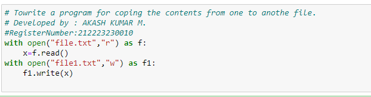

# copy-file
## AIM:
To write a python program for copying the contents from one file to another file.
## EQUIPEMENT'S REQUIRED: 
PC
Anaconda - Python 3.7
## ALGORITHM: 

### Step 1: 
Get the file name and location from the user.
### Step 2: 
Give a new file name to create a copy of a file content.
### Step 3:
 Read the file and close the file.
### Step 4: 
Now write the content in the new file.
### Step 5:
 When done print"File copied successfully".
### Step 6: 
End of the program
## PROGRAM:
```
# To write a program for coping the contents from one to another file.
# Developed by : AKASH KUMAR M.
#RegisterNumber:212223230010
with open("file.txt","r") as f:
    x=f.read()
with open("file1.txt","w") as f1:
    f1.write(x)
```

### OUTPUT:



## RESULT:
Thus the program is written to copy the contents from one file to another file.